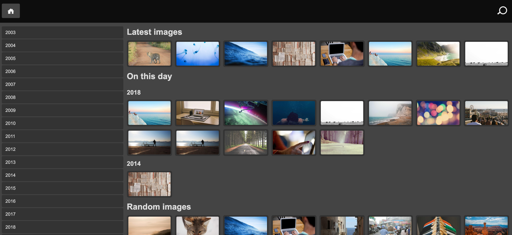

Ralbum汉化精简版
===================

## 概述

### 汉化说明
- 本项目是对[Ralbum]的汉化和精简，去掉了国内无法使用的地图，其他功能无影响。
- Docker镜像基于alpine重新封装，体积仅91.8MB，相比原版镜像916MB减少90%。
- 非常轻量，适合部署在电视盒子、树莓派等轻量级NAS上。
- 原项目地址：https://github.com/ralbum/ralbum.git
- 仅供个人学习和使用，请勿用于商业用途。

### 功能简述
生成文件系统上存在的文件夹和图像（以及其他文件）的列表。
当浏览图像时，它们将显示在图册中， 支持智能设备上的滑动操作和键盘按键。
原始文件仅支持读取，不能对原始文件执行任何写入操作。
对于全部图像，最好使用缩略图以加速浏览（访问触发生成或使用定时cron.php）。



## 功能

### 图像浏览
可以选择浏览原始图像（默认）或查看重新调整大小的图像版本。
当在网速比较慢的情况下，适合使用重新调整大小的图像版本。
可以在`settings.json`中调整图像的大小的参数配置。
另外，缩略图是首次访问即时触发创建的，也可以使用cron.php一次创建这些图像（和缩略图）。
在图像根目录是空的情况下，首页将会展示最近图像列表、历史中同一日期的图像列表和随机图像列表。

### 搜索图像
您可以使用右上角的搜索框搜索图像。您可以输入多个关键词以进一步缩小结果范围。

## 安装
>支持使用Docker安装，也可以自行在LAMP环境上安装配置。推荐使用Docker方式使用，比较方便。

### 使用Docker安装
```
docker pull passkey/ralbum:1.0-alpine
```

拉取镜像后，运行下面的命令来运行ralbum，替换`/xxx/photo_source`为原始图像的目录，`/xxx/live`为缓存和数据目录，可以自定义路径。确保Docker实例对缓存和数据文件夹具有写入权限。

```
docker run --restart=always \
        --name ralbum_live \
        -v /xxx/photo_source:/var/data \
        -v /xxx/live:/var/www/cache \
        -v /xxx/live:/var/www/data \
        -d -p 1247:80 passkey/ralbum:1.0-alpine
```

如果Docker容器已运行，可以通过`http://服务器IP:1247`来访问Ralbum。

```
http://127.0.0.1:1247/
```

使用计划任务每天运行一次cron.php来启用搜索功能，建议在宿主机上运行cronjob，命令如下：

```bash
docker exec ralbum_live /var/www/ralbum_cron.sh
```

## 在基础系统上安装

### 环境要求
* PHP 8.0及更高版本
* 带mod_rewrite或Apache或Nginx（Debian自带的轻量级nginx即可）
* PHP的GD库，但最好是使用Imagick扩展（系统上安装的ImageMagick依赖）
* SQLite3，这是可选的（用于搜索功能），通常随PHP一起提供

### 实施步骤
* 复制内容到DocumentRoot
* 安装composer。可通过[https://getcomposer.org/](https://getcomposer.org/)下载或使用系统的包管理工具安装
* `cd app`; `composer install`; `cd ..`;
* 编辑`settings.json `并将`image_base_dir`修改为图像所在的目录
* 设置`cache`和`data`目录权限，Web服务器用户需要有读写权限

如果要使用搜索功能，您需要运行cron.php文件来生成索引。建议使用计划任务每天运行一次。
```bash
sudo -u www-data php cron.php
```

